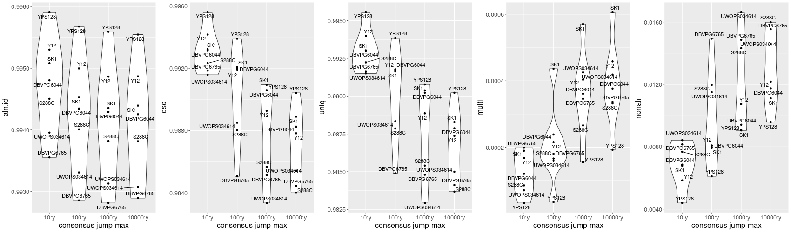

# pgge

## the pangenome graph evaluator

This pangenome graph evaluation pipeline measures the reconstruction accuracy of a pangenome graph (in the variation graph model).
Its goal is to give guidance in finding the best pangenome graph construction tool for a given input data and task.

It has five phases:

1. _`SplitSamples`_: (*sample preparation*) -- SHORT DESCRIPTION. TODO.

2. _[splitfa](https://github.com/ekg/splitfa)_: (*split sequences*) -- SHORT DESCRIPTION. TODO.

3. _[GraphAligner](https://github.com/maickrau/GraphAligner)_: (*alignment*) -- SHORT DESCRIPTION. TODO.

4. _[peanut](https://github.com/subwaystation/rs-peanut)_: (*alignment evaluation*) -- SHORT DESCRIPTION. TODO.

5. _[beehave.R](https://github.com/pangenome/pgge/tree/master/scripts/beehave.R)_: (*plot evaluation results*) -- SHORT DESCRIPTION. TODO.

## general usage

Clone this repository:

```
git clone --recursive https://github.com/pangenome/pgge
cd pgge
```

Create a pangenome graph and its consensus graphs using _`pggb`_, storing the results in the `pggb_yeast` directory.

:warning: This step assumes you have correctly installed _`pggb`_:

```
pggb -i data/yeast/cerevisiae.pan.fa.gz -t 16 -s 50000 -p 90 -n 5 -Y "#" -k 8 -B 10000000 -w 30000 -I 0.7 -o pggb_yeast -W
```

Evaluate the consensus graphs stored in the `pggb_yeast` directory:
```
./pgge -g "pggb_yeast/*consensus*.gfa" -f data/yeast/cerevisiae.pan.fa.gz  -t 16 -r scripts/beehave.R  -l 100000 -s 50000 -o pgge_yeast
```
Make sure that you include the opening and closing `"` in the command line, else the regex can't be resolved. For a single
input GFA, this is not required.

Optionally, you can set `-b` to write the unmapped regions to [BED](https://m.ensembl.org/info/website/upload/bed.html). 

If you only want to enable random subsampling to **reduce alignment time**, you can select either `-p/--subsample-percentage` or `-u/--subsample-number`.

:warning: _`pgge`_ summarizes results by sample name. If you have
```
S288C.chrI
S288C.chrII
S288C.chrIII
```
in your given FASTA file, the results will only contain one line of metrics. In this case for `S288C`. This is useful if
you have contig sequences in your FASTA and want to summarize by sample name. _`pgge`_ always splits by `.` and takes the
first entry in the resulting split as sample name. 

:warning: _`pgge`_ was designed for processing the results
of _`pggb`_. If you are evaluating your own data not originating from _`pggb`_ it is recommended to set the `-n/--input-graph-names` parameter to ensure the final PNG is labeled correctly. This parameters requires a TSV with 2 rows: 

1. The name of the original input graph.
2. The name to display in the PNG.

In the following an example for the yeast data set:

```
cerevisiae.pan.fa.pggb-W-s50000-l150000-p90-n5-a0-K16-k8.seqwish-w30000-j5000-e5000-I0.7.smooth.consensus@10000::y:0:1000000.gfa	10k::y:0:1000k
cerevisiae.pan.fa.pggb-W-s50000-l150000-p90-n5-a0-K16-k8.seqwish-w30000-j5000-e5000-I0.7.smooth.consensus@1000::y:0:1000000.gfa	1k::y:0:1000k
cerevisiae.pan.fa.pggb-W-s50000-l150000-p90-n5-a0-K16-k8.seqwish-w30000-j5000-e5000-I0.7.smooth.consensus@100::y:0:1000000.gfa	0.1k::y:0:1000k
cerevisiae.pan.fa.pggb-W-s50000-l150000-p90-n5-a0-K16-k8.seqwish-w30000-j5000-e5000-I0.7.smooth.consensus@10::y:0:1000000.gfa	0.01k::y:0:1000k
cerevisiae.pan.fa.pggb-W-s50000-p90-n5-a0-K16-k8.seqwish-w30000-j5000-e5000-I0.7.smooth.consensus@10000:y.gfa	10k:y
cerevisiae.pan.fa.pggb-W-s50000-p90-n5-a0-K16-k8.seqwish-w30000-j5000-e5000-I0.7.smooth.consensus@1000:y.gfa	1k:y
cerevisiae.pan.fa.pggb-W-s50000-p90-n5-a0-K16-k8.seqwish-w30000-j5000-e5000-I0.7.smooth.consensus@100:y.gfa	0.1k:y
cerevisiae.pan.fa.pggb-W-s50000-p90-n5-a0-K16-k8.seqwish-w30000-j5000-e5000-I0.7.smooth.consensus@10:y.gfa	0.01k:y
```

### output

The output is written to `pgge_yeast/pgge-l100000-s50000.tsv` in a tab-delimited format:
```
cat pgge_yeast/pgge-l100000-s50000.tsv | column -t
```
```
sample.name  cons.jump  aln.id    qsc                 uniq                multi                    nonaln
DBVPG6044    10000:y    0.994253  0.9882487336244542  0.9878719650655022  0.00037676855895196504   0.011751266375545851
DBVPG6044    1000:y     0.99429   0.9905872052401746  0.9902261572052402  0.00036104803493449783   0.009412794759825328
DBVPG6044    100:y      0.994346  0.9920169432314411  0.9917783406113537  0.00023860262008733625   0.007983056768558951
DBVPG6044    10:y       0.994804  0.9931444978165939  0.9930238427947599  0.00012065502183406113   0.0068555021834061135
DBVPG6765    10000:y    0.992895  0.984453537117904   0.9841169868995633  0.00033655021834061135   0.01554646288209607
DBVPG6765    1000:y     0.992816  0.9851402620087336  0.9847942358078603  0.00034602620087336247   0.014859737991266376
DBVPG6765    100:y      0.992857  0.9850624454148471  0.9848960262008734  0.00016641921397379914   0.014937554585152838
DBVPG6765    10:y       0.993555  0.9918473362445415  0.9916482969432314  0.00019903930131004368   0.008152663755458514
S288C        10000:y    0.993815  0.9840108085106383  0.9836786808510638  0.0003321276595744681    0.015989191489361704
S288C        1000:y     0.993819  0.9856704255319149  0.9854043829787235  0.0002660425531914894    0.014329574468085107
S288C        100:y      0.994008  0.9880367234042553  0.9878560425531915  0.0001806808510638298    0.011963276595744681
S288C        10:y       0.994503  0.9923237872340426  0.9922378723404255  0.00008591489361702127   0.007676212765957447
SK1          10000:y    0.994393  0.98889             0.9882832467532467  0.0006067532467532468    0.01111
SK1          1000:y     0.994355  0.9909501731601732  0.9903794805194805  0.0005706926406926407    0.00904982683982684
SK1          100:y      0.994531  0.9920734632034632  0.9916370995670996  0.00043636363636363637   0.007926536796536796
SK1          10:y       0.99508   0.9932187878787879  0.9930288311688311  0.00018995670995670995   0.006781212121212121
UWOPS034614  10000:y    0.993074  0.9854122807017544  0.9849935964912281  0.0004186842105263158    0.014587719298245615
UWOPS034614  1000:y     0.993131  0.9833553070175438  0.9829300438596491  0.00042526315789473683   0.01664469298245614
UWOPS034614  100:y      0.99331   0.9884982894736842  0.9883386842105263  0.00015960526315789473   0.01150171052631579
UWOPS034614  10:y       0.993955  0.9915775           0.991506403508772   0.00007109649122807018   0.0084225
Y12          10000:y    0.994867  0.9878221834061135  0.9873637554585153  0.00045842794759825325   0.012177816593886464
Y12          1000:y     0.994863  0.9892637554585153  0.9888601746724891  0.0004035807860262009    0.010736244541484715
Y12          100:y      0.994997  0.9919159388646288  0.9917003056768559  0.00021563318777292578   0.00808406113537118
Y12          10:y       0.995301  0.9941565065502184  0.9939880786026201  0.00016842794759825327   0.00584349344978166
YPS128       10000:y    0.995545  0.9904155895196507  0.9902230567685589  0.00019253275109170305   0.009584410480349345
YPS128       1000:y     0.99559   0.9909312663755458  0.9907755458515284  0.00015572052401746726   0.009068733624454149
YPS128       100:y      0.995676  0.993891615720524   0.9938559825327511  0.000035633187772925764  0.006108384279475983
YPS128       10:y       0.99591   0.995602576419214   0.995569519650655   0.000033056768558951964  0.004397423580786026
```

The first number is the `aln.id` derived from the alignment identity GAF field of _`GraphAligner`_. All other metrics can
be found in the [metrics section](https://github.com/pangenome/rs-peanut#metrics) of _`peanut`_.

_`pgge`_ also generates a visualization of the results `pgge_yeast/pgge-l100000-s50000.tsv.png`:


## installation

### required tools
1. _bash_

2. _[samtools](http://www.htslib.org/)_

3. _[splitfa](https://github.com/ekg/splitfa)_

4. _[GraphAligner](https://github.com/maickrau/GraphAligner)_

5. _[peanut](https://github.com/subwaystation/rs-peanut)_

6. _[R](https://www.r-project.org/)_ with packages _[tidyverse](https://www.tidyverse.org/)_, _[ggrepel](https://www.rdocumentation.org/packages/ggrepel/versions/0.9.1)_, _[gridExtra](https://www.rdocumentation.org/packages/gridExtra/versions/2.3)_ installed.

## TODOs
- [x] _`pgge`_ should accept a list of GFA files as input (_path/to/files/\*.consensus\*.gfa_) and output the summarized results in one PNG
- [x] Integrate https://github.com/ekg/splitfa as an option to prepare the input FASTA.
- [x] Add the possibility to split the input by sample name. Later re-use that information in the final result. THIS IS THE NEW DEFAULT. 
- [x] Add R script to visualize the result.
- [x] Explain `aln.id`.
- [x] Add option to directly start from GAF file.
- [x] Add output-folder option.
- [ ] Add possibility to input several GAF files. Make sure the user can input a list of samples for the GAFs.
- [ ] The user should be able to select options for GraphAligner.
- [ ] Add a toolchain that compares the query alignments with the exact nodes they aligned to in the graph.
- [ ] Add Dockerfile.
- [ ] Add a CI building the Dockerfile and emitting evaluation metrics for all tools using `HLA-Zoo` data.
- [ ] Add usage examples for _`minigraph`_, _`cactus`_, and _`SibeliaZ`_.
- [ ] Integrate into nf-core/pangenome pipeline.

## authors

Simon Heumos, Andrea Guarracino, Erik Garrison, Christian Fischer
